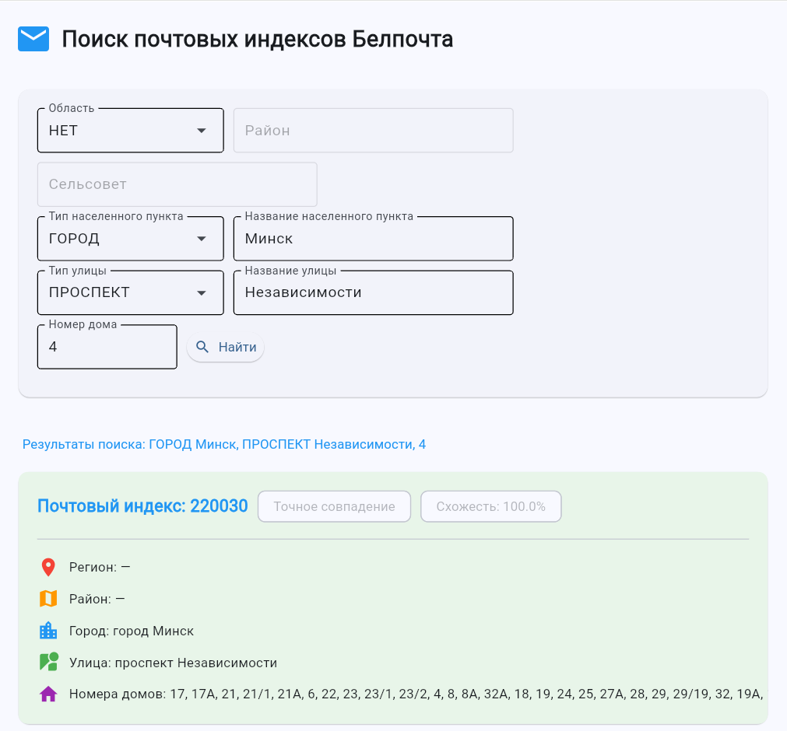

# Поиск адресов Белпочта


Приложение для поиска почтовых индексов и адресов Беларуси с использованием данных Белпочты. Разработано с использованием фреймворка Flet для создания современного пользовательского интерфейса.

<p align="center">
  
</p>

## Функциональность

- **Поиск адресов** по различным параметрам:
  - Область
  - Район
  - Сельсовет
  - Тип населенного пункта
  - Название населенного пункта
  - Тип улицы
  - Название улицы
  - Номер дома
- **Фильтрация результатов** с использованием нечеткого поиска (fuzzy search)
- **Открытие результатов** на официальном сайте Белпочты
- **Сортировка результатов** по релевантности и точности совпадения


## Архитектура приложения

Приложение разработано с использованием принципов чистой архитектуры и разделено на следующие модули:

```
addr_corr/
├── main.py                 # Точка входа в приложение
├── models/                 # Модели данных
│   ├── __init__.py
│   ├── dropdown_values.py  # Перечисления для выпадающих списков
│   └── search_result.py    # Модель результата поиска
├── services/               # Бизнес-логика
│   ├── __init__.py
│   ├── address_service.py  # Основной сервис поиска адресов
│   ├── address_processor.py # Обработка и фильтрация результатов
│   └── belpost_service.py  # Взаимодействие с API Белпочты
├── assets/                 # Ресурсы приложения
│   ├── __init__.py
│   └── styles.py           # Стили и константы UI
├── views/                  # Компоненты интерфейса
│   ├── __init__.py
│   ├── main_view.py        # Основное представление
│   └── components/         # Переиспользуемые компоненты
│       ├── __init__.py
│       ├── header.py       # Заголовок приложения
│       ├── search_form.py  # Форма поиска
│       └── result_card.py  # Карточка результата
├── db/                     # Работа с базой данных
│   └── models.py           # Модели базы данных
└── parser.py               # Парсер данных с сайта Белпочты
```

## Технологии

- **Flet** - фреймворк для создания кроссплатформенных приложений на Python
- **Selenium** - автоматизация взаимодействия с веб-браузером
- **SQLAlchemy** - ORM для работы с базой данных
- **RapidFuzz** - библиотека для нечеткого поиска и сравнения строк
- **Pandas** - обработка и анализ данных

## Установка и запуск

### Предварительные требования

- Python 3.8 или выше
- Виртуальное окружение (рекомендуется)
- Браузер Chrome/Chromium и соответствующий ChromeDriver

### Шаги установки

1. Клонировать репозиторий:
   ```bash
   git clone https://github.com/yourusername/addr_corr.git
   cd addr_corr
   ```

2. Создать и активировать виртуальное окружение:
   ```bash
   python -m venv .addr_corr_venv
   # Для Windows:
   .\.addr_corr_venv\Scripts\activate
   # Для Linux/Mac:
   source .addr_corr_venv/bin/activate
   ```

3. Установить зависимости:
   ```bash
   pip install -r requirements.txt
   ```

4. Создать файл `.env` на основе `.example.env`:
   ```bash
   cp .example.env .env
   # Отредактировать .env файл, указав настройки подключения к БД
   ```

5. Запустить приложение:
   ```bash
   flet run --web main.py
   ```

## Использование

1. Выберите параметры поиска в форме (область, район, тип населенного пункта и т.д.)
2. Нажмите кнопку "Найти"
3. Просмотрите результаты поиска
4. Для открытия результатов на сайте Белпочты нажмите на заголовок "Результаты поиска"
